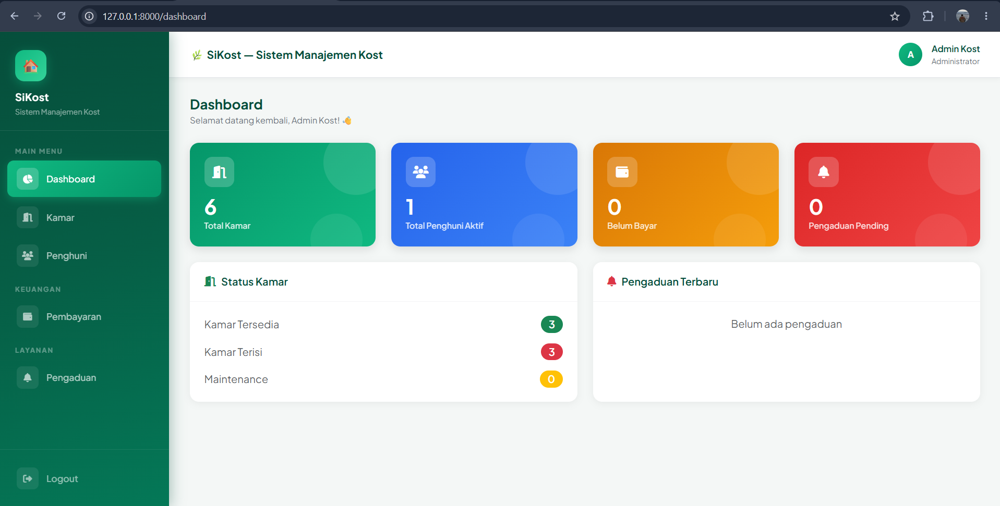
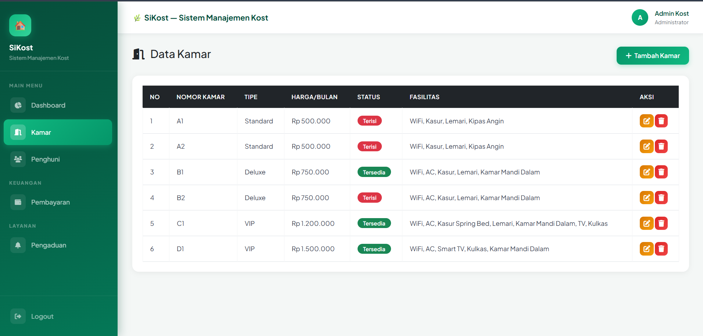
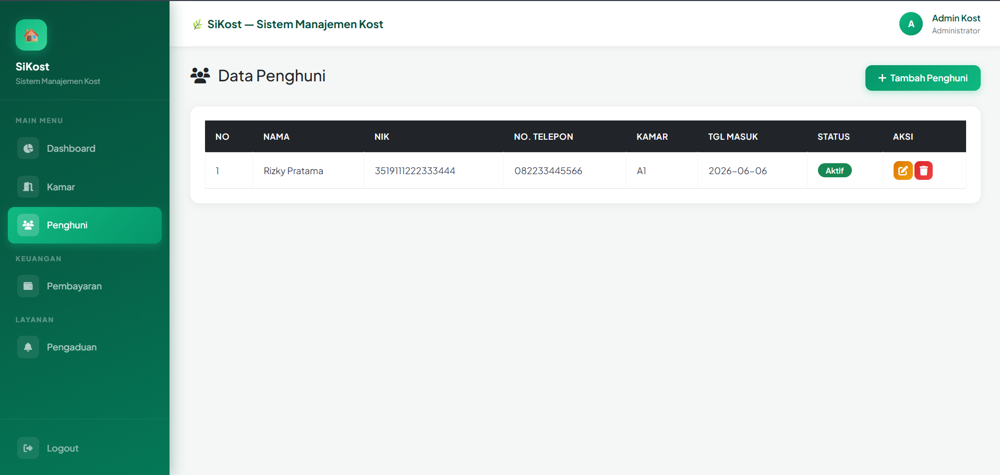

# 🏠 Sistem Manajemen Kost

Aplikasi web untuk mengelola kost/kontrakan berbasis Laravel.

## 👨‍💻 Identitas Developer
- **Nama:** Danar (Ryan5heva)
- **Mata Kuliah:** Pemrograman Web Fullstack
- **Prodi:** Teknik Informatika
- **Universitas:** Universitas PGRI Madiun

## 📋 Fitur Aplikasi
- ✅ Authentication (Login & Register)
- ✅ Dashboard dengan statistik real-time
- ✅ Manajemen Kamar (CRUD)
- ✅ Manajemen Penghuni (CRUD)
- ✅ Manajemen Pembayaran (CRUD)
- ✅ Manajemen Pengaduan (CRUD)
- ✅ REST API dengan Laravel Sanctum
- ✅ Role Admin & User (middleware protection)
- ✅ Seeder data dummy

## 🛠️ Teknologi yang Digunakan
- **Framework:** Laravel 10
- **Database:** MySQL
- **Frontend:** Bootstrap 5, Font Awesome
- **API Auth:** Laravel Sanctum

## 🗄️ Struktur Database
- `users` - Data admin/pengguna
- `kamar` - Data kamar kost
- `penghuni` - Data penghuni kost
- `pembayaran` - Data pembayaran bulanan
- `pengaduan` - Data pengaduan penghuni

## 🚀 Cara Menjalankan Project

### Requirements
- PHP 8.1+
- Composer
- MySQL
- Laravel 10

### Langkah Instalasi
```bash
# 1. Clone repository
git clone https://github.com/Ryan5heva/Sistem-Kost.git
cd Sistem-Kost

# 2. Install dependencies
composer install

# 3. Copy file environment
cp .env.example .env

# 4. Generate key
php artisan key:generate

# 5. Setting database di .env
DB_DATABASE=sistem_kost
DB_USERNAME=root
DB_PASSWORD=

# 6. Jalankan migration
php artisan migrate

# 7. Jalankan seeder
php artisan db:seed

# 8. Jalankan server
php artisan serve

```

## 🔌 API Endpoints

### Auth
| Method | Endpoint | Deskripsi |
|--------|----------|-----------|
| POST | /api/register | Register user baru |
| POST | /api/login | Login & dapat token |
| POST | /api/logout | Logout |
| GET | /api/me | Data user login |

### Kamar
| Method | Endpoint | Deskripsi |
|--------|----------|-----------|
| GET | /api/kamar | Semua kamar |
| POST | /api/kamar | Tambah kamar |
| GET | /api/kamar/{id} | Detail kamar |
| PUT | /api/kamar/{id} | Update kamar |
| DELETE | /api/kamar/{id} | Hapus kamar |

### Penghuni
| Method | Endpoint | Deskripsi |
|--------|----------|-----------|
| GET | /api/penghuni | Semua penghuni |
| POST | /api/penghuni | Tambah penghuni |
| GET | /api/penghuni/{id} | Detail penghuni |
| PUT | /api/penghuni/{id} | Update penghuni |
| DELETE | /api/penghuni/{id} | Hapus penghuni |

### Pembayaran
| Method | Endpoint | Deskripsi |
|--------|----------|-----------|
| GET | /api/pembayaran | Semua pembayaran |
| POST | /api/pembayaran | Tambah pembayaran |
| GET | /api/pembayaran/{id} | Detail pembayaran |
| PUT | /api/pembayaran/{id} | Update pembayaran |
| DELETE | /api/pembayaran/{id} | Hapus pembayaran |

### Pengaduan
| Method | Endpoint | Deskripsi |
|--------|----------|-----------|
| GET | /api/pengaduan | Semua pengaduan |
| POST | /api/pengaduan | Tambah pengaduan |
| GET | /api/pengaduan/{id} | Detail pengaduan |
| PUT | /api/pengaduan/{id} | Update pengaduan |
| DELETE | /api/pengaduan/{id} | Hapus pengaduan |

## 👥 Role & Akses

| Role | Akses |
|------|-------|
| **Admin** | CRUD semua data |
| **User** | Lihat data & tambah pengaduan |

### Default Akun
| Email | Password | Role |
|-------|----------|------|
| admin@kost.com | password123 | Admin |
| budi@gmail.com | password123 | User |
| siti@gmail.com | password123 | User |

## 📸 Screenshot
### Dashboard


### Data Kamar


### Data Penghuni
