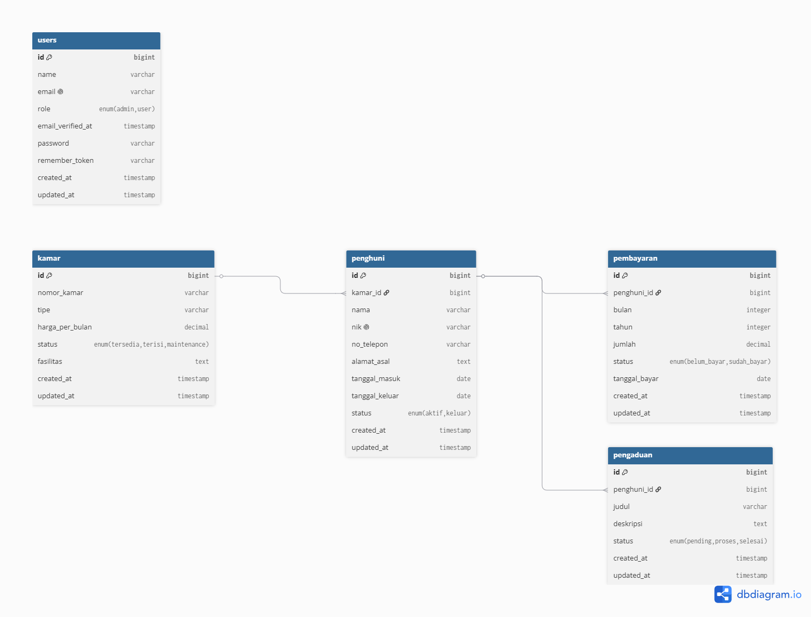

# 🏠 SiKost - Sistem Manajemen Kost

Laporan UTS Praktikum Pemrograman Web Fullstack

- **Nama:** Ryan Sheva Danarindra
- **NIM:** 2305101016
- **Kelas:** 6B

---

## 🗄️ ERD Database & Relasi

### Struktur Tabel


### Relasi Eloquent
- `Kamar` **hasMany** `Penghuni`
- `Penghuni` **belongsTo** `Kamar`
- `Penghuni` **hasMany** `Pembayaran`
- `Penghuni` **hasMany** `Pengaduan`
- `Pembayaran` **belongsTo** `Penghuni`
- `Pengaduan` **belongsTo** `Penghuni`

---

## 🔌 Daftar Endpoint API

| No | Method | Endpoint | Akses | Deskripsi |
|----|--------|----------|-------|-----------|
| 1 | POST | /api/register | Public | Daftar user baru |
| 2 | POST | /api/login | Public | Login & dapat token |
| 3 | POST | /api/logout | Auth | Logout |
| 4 | GET | /api/me | Auth | Data user login |
| 5 | GET | /api/kamar | Auth | Lihat semua kamar |
| 6 | POST | /api/kamar | Admin | Tambah kamar |
| 7 | GET | /api/kamar/{id} | Auth | Detail kamar |
| 8 | PUT | /api/kamar/{id} | Admin | Update kamar |
| 9 | DELETE | /api/kamar/{id} | Admin | Hapus kamar |
| 10 | GET | /api/penghuni | Auth | Lihat semua penghuni |
| 11 | POST | /api/penghuni | Admin | Tambah penghuni |
| 12 | GET | /api/penghuni/{id} | Auth | Detail penghuni |
| 13 | PUT | /api/penghuni/{id} | Admin | Update penghuni |
| 14 | DELETE | /api/penghuni/{id} | Admin | Hapus penghuni |
| 15 | GET | /api/pembayaran | Auth | Lihat semua pembayaran |
| 16 | POST | /api/pembayaran | Admin | Tambah pembayaran |
| 17 | GET | /api/pembayaran/{id} | Auth | Detail pembayaran |
| 18 | PUT | /api/pembayaran/{id} | Admin | Update pembayaran |
| 19 | DELETE | /api/pembayaran/{id} | Admin | Hapus pembayaran |
| 20 | GET | /api/pengaduan | Auth | Lihat semua pengaduan |
| 21 | POST | /api/pengaduan | Auth | Tambah pengaduan |
| 22 | GET | /api/pengaduan/{id} | Auth | Detail pengaduan |
| 23 | PUT | /api/pengaduan/{id} | Admin | Update pengaduan |
| 24 | DELETE | /api/pengaduan/{id} | Admin | Hapus pengaduan |

---

## 👥 Akun Default (Seeder)

| Email | Password | Role |
|-------|----------|------|
| admin@kost.com | password123 | Admin |
| budi@gmail.com | password123 | User |
| siti@gmail.com | password123 | User |

---

## 📬 Testing & Dokumentasi API (Postman)

### 1. Auth

**POST /api/register**


**POST /api/login**


**POST /api/logout**


### 2. Kamar

**GET /api/kamar**


**POST /api/kamar** *(Admin only)*


**PUT /api/kamar/{id}** *(Admin only)*


**DELETE /api/kamar/{id}** *(Admin only)*


### 3. Pembayaran

**GET /api/pembayaran**


**POST /api/pembayaran** *(Admin only)*


### 4. Me

**GET /api/me**


---

## 📋 Format Response Standar

**Success:**
```json
{
    "success": true,
    "message": "Pesan sukses",
    "data": {}
}
```

**Error:**
```json
{
    "success": false,
    "message": "Pesan error"
}
```

---

## 📌 Header Wajib

Setiap request API wajib menyertakan header:
```
Accept: application/json
Authorization: Bearer {token}
```

---

## 🔐 Middleware & Otorisasi

| Middleware | Fungsi |
|-----------|--------|
| `auth:sanctum` | Memastikan user sudah login dengan token |
| `admin` | Memastikan user memiliki role admin |

**Role Admin:** Bisa akses semua endpoint (CRUD)
**Role User:** Hanya bisa GET data & POST pengaduan

---

## ⚠️ Kendala dan Solusi

| No | Kendala | Solusi |
|----|---------|--------|
| 1 | Laravel v13 tidak kompatibel dengan PHP 8.1 | Menggunakan Laravel 10 |
| 2 | Node.js tidak terinstall, Vite tidak bisa jalan | Menggunakan Bootstrap 5 via CDN |
| 3 | Composer timeout saat install package | Mengganti mirror Composer |
| 4 | GitHub tidak support autentikasi password | Menggunakan GitHub Desktop |
| 5 | Response API mengembalikan HTML bukan JSON | Menambahkan header Accept: application/json |

---

## 🚀 Langkah Instalasi Lokal

### Persyaratan Sistem
- PHP 8.1+
- Composer
- MySQL
- Laravel 10

### Cara Instalasi
```bash
# 1. Clone repository
git clone https://github.com/Ryan5heva/Sistem-Kost.git
cd Sistem-Kost

# 2. Install dependencies
composer install

# 3. Copy file environment
cp .env.example .env

# 4. Generate key
php artisan key:generate

# 5. Setting database di .env
DB_DATABASE=sistem_kost
DB_USERNAME=root
DB_PASSWORD=

# 6. Jalankan migration
php artisan migrate

# 7. Jalankan seeder
php artisan db:seed

# 8. Jalankan server
php artisan serve
```

---

## 📦 Postman Collection

File collection tersedia di: `postman_collection.json`

Import ke Postman:
1. Buka Postman
2. Klik **Import**
3. Pilih file `postman_collection.json`

---

## 🛠️ Tech Stack

| Komponen | Teknologi |
|----------|-----------|
| Framework | Laravel 10 |
| Database | MySQL |
| Frontend | Bootstrap 5, Font Awesome 6 |
| API Auth | Laravel Sanctum |
| Version Control | Git & GitHub |
| API Testing | Postman |